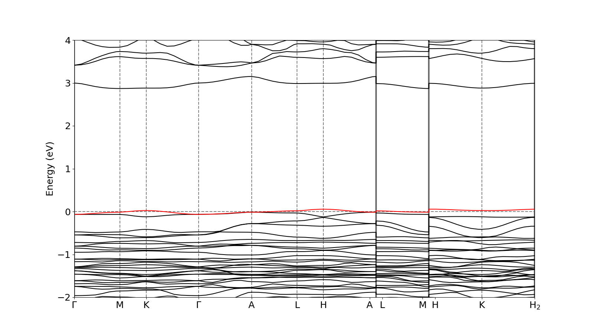
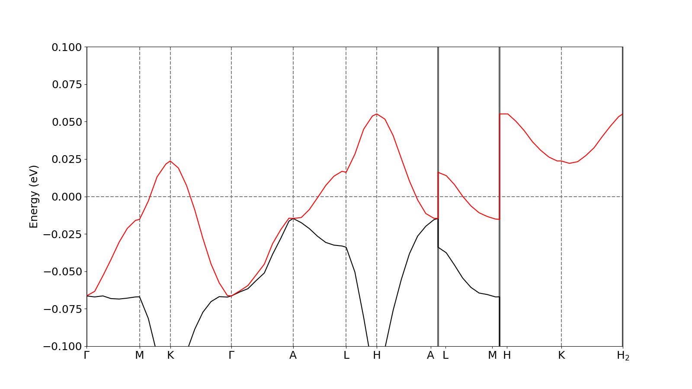

# What is this?
This is a collection of input files for conducting band structure calculations of LK-99 using Quantum Espresso. The calculation parameters are based on https://arxiv.org/abs/2307.16040. It has been tested on Ubuntu, with the machine specifications detailed below. Please be aware that I am a novice in this field and cannot guarantee the accuracy of these calculations.

# Install Quantum Espresso
The following are instructions on how to install Quantum Espresso. Feel free to adjust them to suit your specific environment.
```sh
% git clone https://github.com/QEF/q-e.git
% cd q-e
% ./configure
% make all
```

# Clone this repository
```sh
% git clone https://github.com/A5size/qe_lk99.git
```

# Run
Running run.sh will initiate a sequence of calculations, ending with the band structure calculation. Before executing run.sh, please specify the path to your Quantum Espresso installation and the number of cores you intend to use.

```sh
% pwd
/home/username/qe_lk99
% ./run.sh > log &
```

Upon completion of the calculations, a band structure diagram will be outputted as a file named bands_wide.png.

# Results
## Machine Specifications and Calculation Time
The tests were conducted on a machine with the following specifications:  
OS: Ubuntu 20.04.6 LTS  
Processor: AMD Ryzen 5 PRO 4650G (3.7-4.2GHz/6 cores/12 threads/8MB cache/TDP 65W)  
Memory: DDR4-2666 16GB×2 (Dual channel, Total 32GB) 

The calculation times for parallelization with 6 cores using MPI were as follows:
1. 01scf (1h35m)
2. 02nscf (2h48m)
3. 03bands (4h13m)
4. 04plotbands (7m10.92s)

## Band Structure
The following band structure was obtained.



Like the reference paper, flat bands near the Fermi level are visible.

Upon closer inspection, the following image was obtained.



Comparing with the reference paper, it seems that the entire band is approximately 0.02eV lower. I am unsure whether this discrepancy is due to slight differences in calculation conditions or if there is an issue with the input file. If you notice anything unusual, please contact me.


